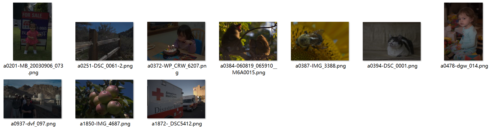
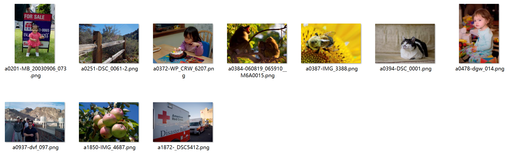

# DPED for MIT-Adobe-5K

从官方代码直接 copy，然后改成可以用来跑 fiveK；官方原来的代码，直接把所有图片一口气全部读到内存。。。这不符合我的经济状况，所以我用 torch 的 dataloader 帮个忙（也可以自己写一个）来读取数据，然后顺便简化了下训练过程，而且图片不是 crop 的，而是 resize 的。最后写了下推理的代码，inference.py，视觉效果还不错

A modified version of [official code](https://github.com/aiff22/DPED) for it is not convinient to train other datasets, i.e MIT-Adobe-FiveK.

《DSLR-Quality Photos on Mobile Devices with Deep Convolutional Networks》

整个代码看起来很乱，但本人时间不足，能跑就行了。在 MIT-Adobe--5K  数据集 expertC  上达到了 **psnr 24.064**db 和 **ssim 0.8786** 的性能，在 2017 年来说是相当不错的了，网络结构也很简单，视觉效果也没有很明显的 artifacts。

The code is ugly for my random modification. But I have achieved **24.064**db  and **0.8786** in PSNR and SSIM for ExpertC of MIT-Adobe-FiveK, respectively.


## Usage

1. **推理 inference** 

   修改 28-29 行(lines)，input_dir 跟 output_dir

   ```shell
   python inference.py
   ```

   > 输入  ./demo/input

   

   > 输出  ./demo/output

   

2. **训练 train**

   如果要换其他数据集，就要在 17-33 行(lines) 修改，然后其他参数也看着改吧。

   ```shell
   python train_model.py
   ```

   中途训练的一些视觉对比结果保存在了 ./visual_results/ 目录下

   

3. **测试 test**

   ```shell
   python inference_and_test.py
   ```

   > 500/500===> [psnr 24.064 - 18.615] [ssim 0.8786 - 0.7645]


## Data

MIT-Adobe-FiveK：

- 4000 训练，for training
- 500    验证,  for validation
- 500    测试,  for testing

数据都是 512px，最大边长，长宽比还保持着，with a max length 512 of each image。

都是 8比特，png 无损格式, all images are formatted with 8bit dynamic range and saved with png.

可以从这里下载

- 阿里云     [Aliyun](https://www.aliyundrive.com/s/99kNhj7vLhn)
- 谷歌云盘 [Google Drive](https://drive.google.com/file/d/1pSdSND1LNumdZjyEaZIj5A-iZdyyxfia/view?usp=sharing)


## Pretrained

1. 在文件夹 ./pretrained/
2. 训练需要的 [vgg](https://drive.google.com/file/d/17ZHo9xXjnqc8he38cp1F2DKtmAhezC8C/view?usp=sharing) 和官方的保持一致


# Citation

```
@inproceedings{ignatov2017dslr,
  title={DSLR-Quality Photos on Mobile Devices with Deep Convolutional Networks},
  author={Ignatov, Andrey and Kobyshev, Nikolay and Timofte, Radu and Vanhoey, Kenneth and Van Gool, Luc},
  booktitle={Proceedings of the IEEE International Conference on Computer Vision},
  pages={3277--3285},
  year={2017}
}
@inproceedings{bychkovsky2011learning,
  title={Learning photographic global tonal adjustment with a database of input/output image pairs},
  author={Bychkovsky, Vladimir and Paris, Sylvain and Chan, Eric and Durand, Fr{\'e}do},
  booktitle={CVPR},
  pages={97--104},
  year={2011},
  organization={IEEE}
}
@article{wang2004image,
  title={Image quality assessment: from error visibility to structural similarity},
  author={Wang, Zhou and Bovik, Alan C and Sheikh, Hamid R and Simoncelli, Eero P},
  journal={TIP},
  volume={13},
  number={4},
  pages={600--612},
  year={2004},
  publisher={IEEE}
}
```

